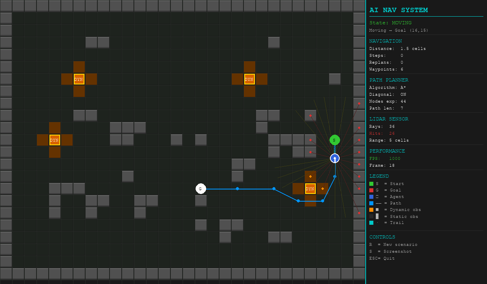
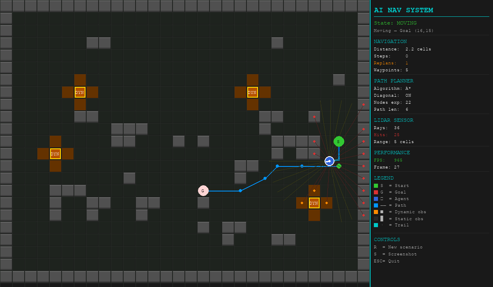
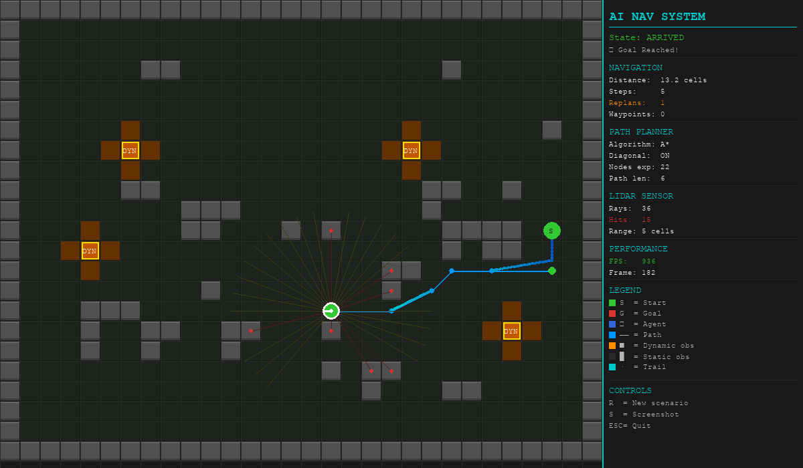
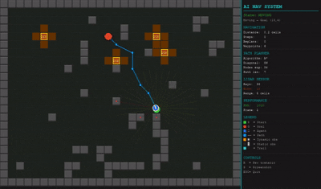

# 🤖 AI-Based Autonomous Navigation System

> A complete simulation of an AI-powered autonomous navigation system featuring
> real-time A\* path planning, simulated LiDAR sensors, dynamic obstacle avoidance,
> and a live performance dashboard — built entirely in Python without GPU or external datasets.


---

## 📌 Project Overview

This project simulates an autonomous navigation system — the core technology behind
**self-driving cars, warehouse robots, delivery drones, and industrial automation**.

The system demonstrates:

- **Perception** via simulated LiDAR ray-casting (36-ray scan)
- **Occupancy mapping** from sensor data (like real robot SLAM)
- **A\* path planning** with diagonal movement and path smoothing
- **Dynamic replanning** when moving obstacles block the path
- **State machine decision engine** (MOVING → REPLANNING → MOVING)
- **Real-time Pygame visualization** with live performance dashboard

---

## 🎯 Problem Statement

Mobile autonomous agents (robots, cars, drones) must navigate complex,
dynamic environments without human intervention. This requires solving:

1. _Where am I?_ — Localization
2. _What's around me?_ — Perception
3. _How do I get there safely?_ — Planning & Control

This project implements all three layers in a virtual simulation environment.

---

## 🏭 Industry Relevance

| Industry                | Application                            |
| ----------------------- | -------------------------------------- |
| 🚗 Autonomous Vehicles  | Tesla Autopilot, Waymo path planning   |
| 📦 Warehouse Automation | Amazon Robotics, DHL sorting robots    |
| 🚁 Drone Navigation     | DJI autonomous flight, delivery drones |
| 🏥 Healthcare Robots    | Hospital delivery robots               |
| 🏗️ Industrial Safety    | Hazardous zone inspection robots       |

---

## 🛠️ Tech Stack

| Component           | Technology                    |
| ------------------- | ----------------------------- |
| Language            | Python 3.10+                  |
| Simulation          | Pygame 2.5                    |
| Computer Vision     | OpenCV 4.9                    |
| Numerical Computing | NumPy                         |
| Visualization       | Matplotlib                    |
| Path Planning       | Custom A\* implementation     |
| Sensor Model        | Ray-casting LiDAR simulation  |
| Output              | imageio (MP4 video), CSV logs |

---

## 🏗️ Architecture
```
┌─────────────────────────────────────────────────────────────────┐
│                   AI Autonomous Navigation System                │
│                                                                 │
│  ┌──────────────┐    ┌──────────────┐    ┌──────────────────┐  │
│  │  SIMULATION  │───▶│  PERCEPTION  │───▶│  OCCUPANCY GRID  │  │
│  │    ENGINE    │    │   MODULE     │    │    BUILDER       │  │
│  │  (Pygame)    │    │  (OpenCV +   │    │  (NumPy array)   │  │
│  └──────────────┘    │   sensors)   │    └────────┬─────────┘  │
│                      └──────────────┘             │            │
│                                                   ▼            │
│  ┌──────────────┐    ┌──────────────┐    ┌──────────────────┐  │
│  │  NAVIGATION  │◀───│   DECISION   │◀───│  PATH PLANNING   │  │
│  │  CONTROLLER  │    │    ENGINE    │    │  (A* Algorithm)  │  │
│  │  (velocity,  │    │  (rules +    │    │  Dynamic replan  │  │
│  │   steering)  │    │   states)    │    └──────────────────┘  │
│  └──────┬───────┘    └──────────────┘                          │
│         │                                                       │
│         ▼                                                       │
│  ┌──────────────┐    ┌──────────────┐    ┌──────────────────┐  │
│  │    AGENT     │───▶│  VISUALIZER  │───▶│  OUTPUT LOGGER   │  │
│  │   (Vehicle)  │    │  (Pygame +   │    │  (screenshots,   │  │
│  └──────────────┘    │  dashboard)  │    │   video, CSV)    │  │
│                      └──────────────┘    └──────────────────┘  │
└─────────────────────────────────────────────────────────────────┘
```
---

## 📁 Folder Structure
```
AI-Autonomous-Navigation-System/
├── simulation/ # World environment, maps, dynamic obstacles
├── src/ # Core AI modules (perception, planning, control)
├── outputs/ # Auto-saved screenshots, videos, CSV logs
├── images/ # README images and architecture diagrams
├── docs/ # Technical documentation
├── notebooks/ # Jupyter A\* visualization demo
├── tests/ # Pytest unit tests
├── main.py # Simulation entry point
├── config.py # All configuration constants
└── requirements.txt
```
---

## ⚙️ Installation

```bash
# Clone the repository
git clone https://github.com/YOUR_USERNAME/AI-Autonomous-Navigation-System.git
cd AI-Autonomous-Navigation-System

# Create and activate virtual environment
python -m venv venv
venv\Scripts\activate        # Windows
source venv/bin/activate     # Mac/Linux

# Install dependencies
pip install -r requirements.txt
```

---

## 🚀 How to Run

```bash
# Run the full simulation
python main.py

# Run unit tests
python -m pytest tests/ -v

# Open Jupyter demo
jupyter notebook notebooks/path_planning_demo.ipynb
```

**Controls:**

- `R` — Reset with a new random map
- `S` — Take a screenshot
- `ESC` — Quit (saves video automatically)

---

## 🎮 Simulation Workflow

1. **Environment generates** — 25 static obstacles + 4 dynamic moving obstacles
2. **LiDAR scans** — 36 rays fan out from the agent every frame
3. **Occupancy grid updates** — Sensor data builds a navigable map
4. **A\* plans the path** — Optimal route computed from start to goal
5. **Agent moves** — Follows waypoints with smooth motion
6. **Dynamic obstacle blocks path** → State changes to REPLANNING
7. **A\* replans** from current position → Navigation continues
8. **Goal reached** — Stats printed, outputs saved

---

## 📊 Results

| Metric                    | Value               |
| ------------------------- | ------------------- |
| Path planning algorithm   | A\* (8-directional) |
| Average path length       | 25–40 grid cells    |
| Replanning events per run | 1–4                 |
| LiDAR rays per scan       | 36                  |
| Simulation FPS            | ~30                 |
| Video output              | MP4, 30fps          |

---

## 📸 Screenshots

| Initial State                                    | Replanning                                     | Goal Reached                                 |
| ------------------------------------------------ | ---------------------------------------------- | -------------------------------------------- |
|  |  |  |

### Demo



---

## 🔮 Future Improvements

- [ ] ROS 2 integration for real robot deployment
- [ ] CARLA simulator integration (3D autonomous driving)
- [ ] SLAM (Simultaneous Localization and Mapping)
- [ ] Reinforcement Learning navigation policy (PPO/DQN)
- [ ] Real-time webcam input for obstacle detection
- [ ] Multi-agent coordination (fleet navigation)
- [ ] 3D Gazebo simulation

---

## 📚 Learning Outcomes

- Implemented A\* pathfinding from scratch
- Designed a sensor simulation (LiDAR ray-casting)
- Built a state machine decision engine
- Applied modular software architecture (Industry pattern)
- Created real-time visualization with Pygame
- Automated output logging (video, CSV, screenshots)

---

## 👤 Author

**[CH S K CHAITANYA]**  
📧 chskchaitanya755@gmail.com  
🔗 [LinkedIn](https://linkedin.com/in/chskchaitanya)  
🐙 [GitHub](https://github.com/CH-S-K-CHAITANY)

---

## 📄 License

MIT License — Free to use, fork, and build upon.
